# CISRNet
<!-- Further instruction will be provided later. -->

This is the official repository of "CISRNet: Compressed Image Super-Resolution Network".

We provide the training and testing code for generating CISRNet.
If you found this repository useful, please check our paper in [[arXiv](https://arxiv.org/abs/2201.06045)].

Our project presentation is available [[here](https://drive.google.com/file/d/1J1DgLb-LlRnwumdKkebopzZoxyDaASFs/view)]

<!-- TODO: Add Figure 2 in the paper here -->

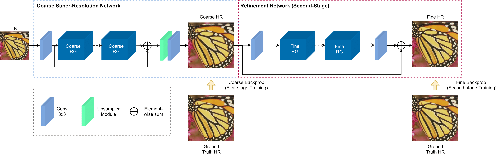

## Package Installations
We recommmend using [conda](https://www.anaconda.com/products/individual) for installation:
```bash
conda env create -f environment.yml
conda activate cisr
```

## Data Preparation
<!-- Further explanations regarding ways to prepare data for training/testing will be provided here -->

### Preparing Training Data
The following steps provide ways to prepare data necessary for training our model:
1. First, create a local directory named `dataset` in the main `CISR` directory.
2. Next, download [DIV2K](https://cv.snu.ac.kr/research/EDSR/DIV2K.tar) dataset and store it on the previously prepared `dataset` folder.
3. Unpack the tar file. To extract the downloaded dataset, run the following script:
```bash
tar -xvf DIV2K.tar
```
3. Create folders for storing the compressed low-resolution (LR) training images in `DIV2K_train_LR_bicubic`. One way to do so is by doing the following:
```bash
cd dataset/DIV2K
mkdir DIV2K_train_LR_bicubicLQ DIV2K_train_LR_bicubicLQ/X2 DIV2K_train_LR_bicubicLQ/X3 DIV2K_train_LR_bicubicLQ/X4

```
4. Head towards the `/src/data` folder and perform compression for the LR images within `DIV2K_train_LR_bicubic`. The following script is an example to compress X2 LR training images:
```python
python resave_jpeg.py --input_dir=../../dataset/DIV2K/DIV2K_train_LR_bicubic/X2 \
                      --output_dir=../../dataset/DIV2K/DIV2K_train_LR_bicubicLQ/X2 \ 
                      --quality=10
```
Note: To compress X3 and X4 LR training images, simply replace `X2` in the above script with `X3` and `X4`.

### Preparing Validation/Testing Data
We perform validation on the following test datasets:

| Dataset | Info |
|---------|:----:|
| Set5 | [info](https://people.rennes.inria.fr/Aline.Roumy/results/SR_BMVC12.html) |
| Set14 | [info](https://sites.google.com/site/romanzeyde/research-interests) |
| B100 | [info](https://www2.eecs.berkeley.edu/Research/Projects/CS/vision/bsds/) |
| Urban100 | [info](https://github.com/jbhuang0604/SelfExSR) |
| Manga109 |[info](http://www.manga109.org/en/) |

The following steps provide ways to prepare data necessary for performing validation and testing our model:
1. First, head onto `dataset` folder in the main `CISR` directory.
2. Next, download benchmark datasets (Set5, Set14, B100, and Urban100) [here](https://cv.snu.ac.kr/research/EDSR/benchmark.tar) and download Manga109 dataset [here](http://www.manga109.org/en/download.html) and store them on `dataset` folder.
3. Then, extract the compressed files and make sure folders which indicate the dataset name are located in `dataset/benchmark` folder.
4. After that, head towards the `/src/data` folder and perform compression for the LR images within `LR_bicubic` folder in each of these datasets. 
The following script is an example to compress X2 LR images in Set5 dataset:
```python
python resave_jpeg.py --input_dir=../../test/Set5/LR_bicubic/X2 \
                      --output_dir=../../test/Set5/LR_bicubic/X2 \ 
                      --quality=10
```

Note: In case of Manga109 dataset, we are only provided with the HR images. To generate the LR images with degradation, please refer to our paper and use bicubic downsampling.


## Training Code
<!-- Further explanations regarding ways of training our model will be available here -->
Our model employs two-stage training. 

The first stage is dedicated for training the coarse super-resolution network.

The following steps provide ways to perform first-stage training for our model:
1. Head onto `src` folder as follows:
```bash
cd src
```
2. Run the following script to perform first-stage training and save training results (model weights, image validation results, configs, logs, etc.) in `./experiments/CISR_first_stage/` for generating model that performs image upscaling for a factor of 2.
```python
python main.py --scale 2 \
               --save CISR_first_stage \
               --model CISR \
               --epochs 100 \
               --decay 75 \
               --gamma 0.1 \
               --batch_size 16 \
               --data_range 001-800 \
               --patch_size 48 \
               --reset \ 
               --data_test Set5 \
               --use_lq_train \
               --use_lq_test \
               --first_stage_training \
               --loss 0.1*L1
```
Note:
- Here, you can specify `--scale` as 2, 3, or 4 in case you want to create model that is optimized for image upscaling of factor 2, 3, or 4, respectively.

The second stage is dedicated for jointly training the coarse super-resolution network and refinement network under supervision from the refinement network output.

The following steps provide ways to perform second-stage training for our model:
1. Head onto `src` folder as follows:
```bash
cd src
```
2. Next, run the following script to perform second-stage training using model obtained in `./experiments/CISR_first_stage` and save training results (model weights, image validation results, configs, logs, etc.) in `./experiments/CISR_second_stage/`.
```python
python main.py --scale 2 \
               --save CISR_second_stage \
               --pre_train ../experiment/CISR_first_stage/model/model_latest.pt \ 
               --model CISR \ 
               --lr 75e-6 \
               --epochs 200 \
               --decay 150 \
               --gamma 0.1 \
               --batch_size 16 \
               --data_range 001-800 \ 
               --patch_size 48 \ 
               --reset \
               --data_test Set5 \ 
               --use_lq_train \
               --use_lq_test \
               --second_stage_training \ 
               --loss 1*L1+0.05*VGG54
```
Note:
- Here, you can specify `--scale` as 2, 3, or 4 in case you want to create model that is optimized for image upscaling of factor 2, 3, or 4, respectively. 
- For more details on arguments to be passed, please refer to [`option.py`](./src/option.py).

## Testing Code
<!-- Further explanations regarding ways of testing our model will be available here -->

To perform validation on various datasets (Set5, Set14, B100, Urban100, Manga109).
1. Head onto `src` folder as follows:
```bash
cd src
```
2. Run the following script to evaluate the fully trained model in `./experiments/CISR_second_stage/` on various aformentioned benchmark datasets.
```python
python main.py --scale 2 \
               --save CISR_second_stage \
               --pre_train ../experiment/CISR_second_stage/model/model_best.pt \ 
               --model CISR \
               --lr 75e-6 \
               --epochs 200 \ 
               --decay 150 \
               --gamma 0.1 \
               --batch_size 16 \
               --data_range 001-800 \ 
               --patch_size 48 \
               --data_test Set5+Set14+B100+Urban100+Manga109 \
               --use_lq_train \
               --use_lq_test \
               --second_stage_training \ 
               --loss 1*L1+0.05*VGG54 \
               --test_only \
               --save_results \
               --metric psnr
```
Note: 
- Images that is subject to testing needs to be located in `./dataset/benchmarks/` folder, and must include the `HR` and `LR_bicublic` images for appropriate measurement.
- `--metric` argument provides measurements for measuring the quality of the super-resolved image. We provide measurements in both PSNR (`--metric psnr`) and SSIM (`--metric ssim`)
- For more details on arguments to be passed, please refer to [`option.py`](./src/option.py)

## Sample Results

Set5 (x4)
| HR | VDSR | RDN | RCAN | CISR (ours) |
|:--:|:----:|:---:|:----:|:-----------:|
| 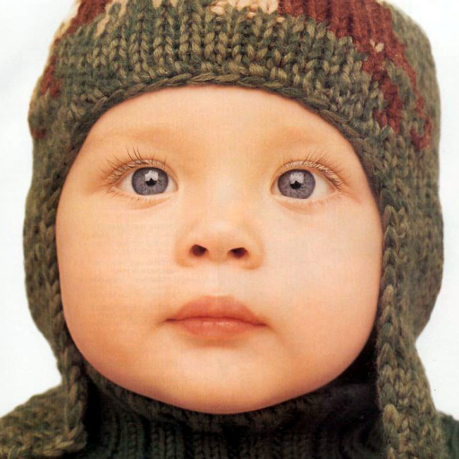 |  | 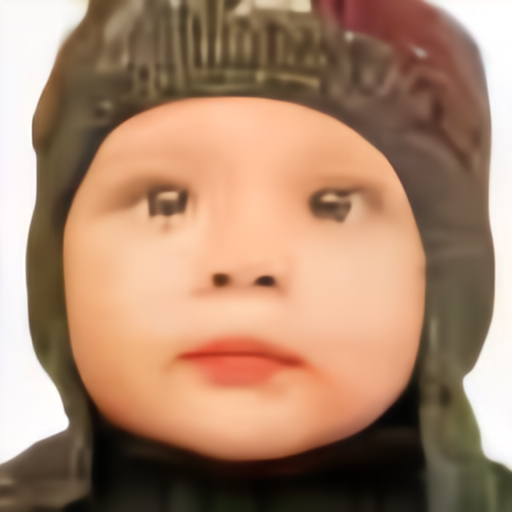 | 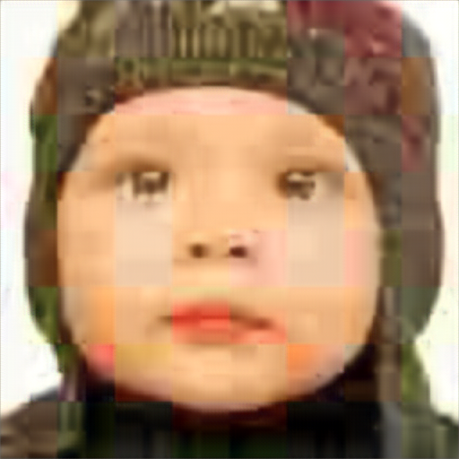 | 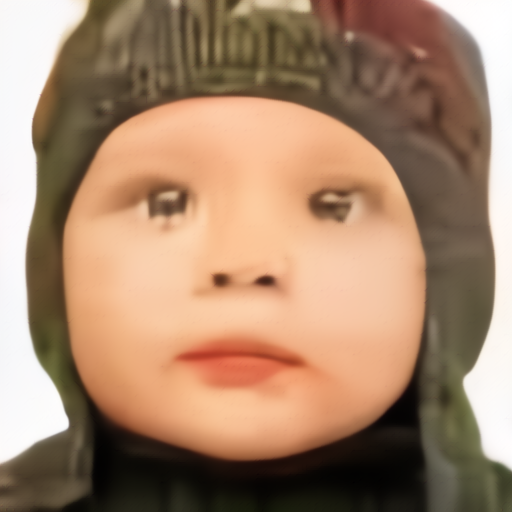 |

Set14 (x4)
| HR | VDSR | RDN | RCAN | CISR (ours) |
|:--:|:----:|:---:|:----:|:-----------:|
|  |  |  | 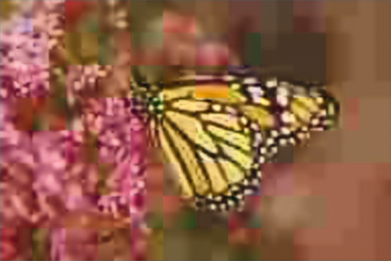 |  |

B100 (x4)
| HR | VDSR | RDN | RCAN | CISR (ours) |
|:--:|:----:|:---:|:----:|:-----------:|
| 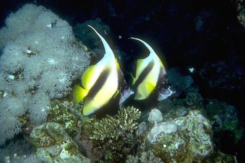 | 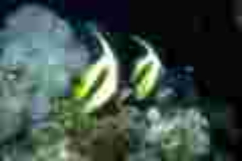 |  | 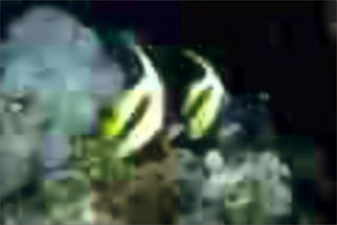 | 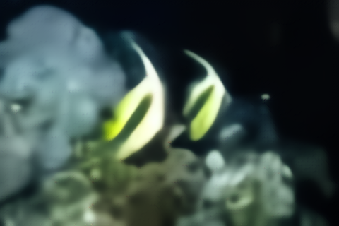 |

Urban100 (x4)
| HR | VDSR | RDN | RCAN | CISR (ours) |
|:--:|:----:|:---:|:----:|:-----------:|
|  | 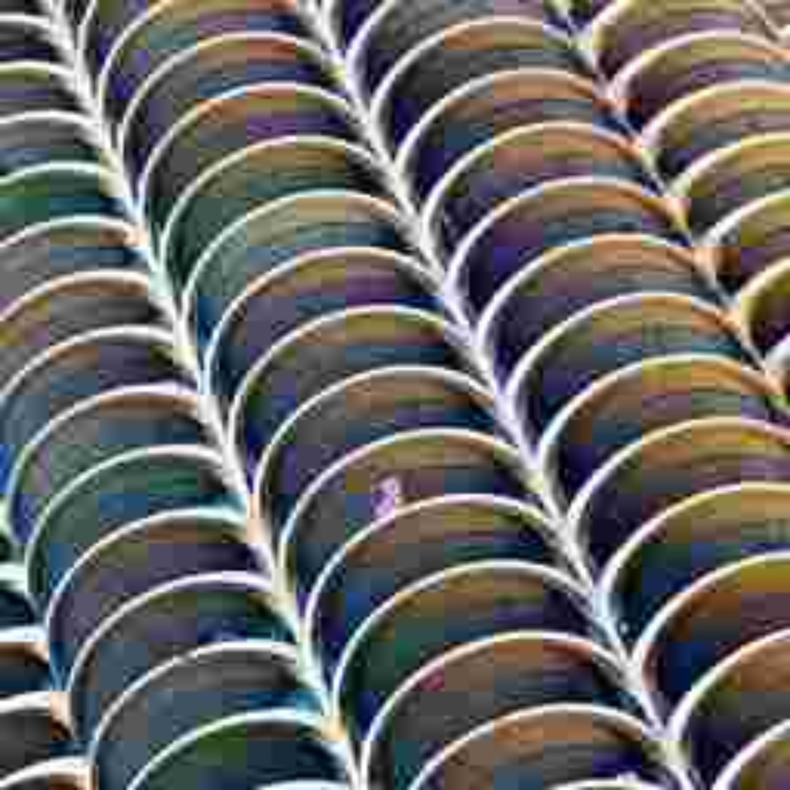 |  |  |  |

Manga109 (x4)
| HR | VDSR | RDN | RCAN | CISR (ours) |
|:--:|:----:|:---:|:----:|:-----------:|
|  |  | 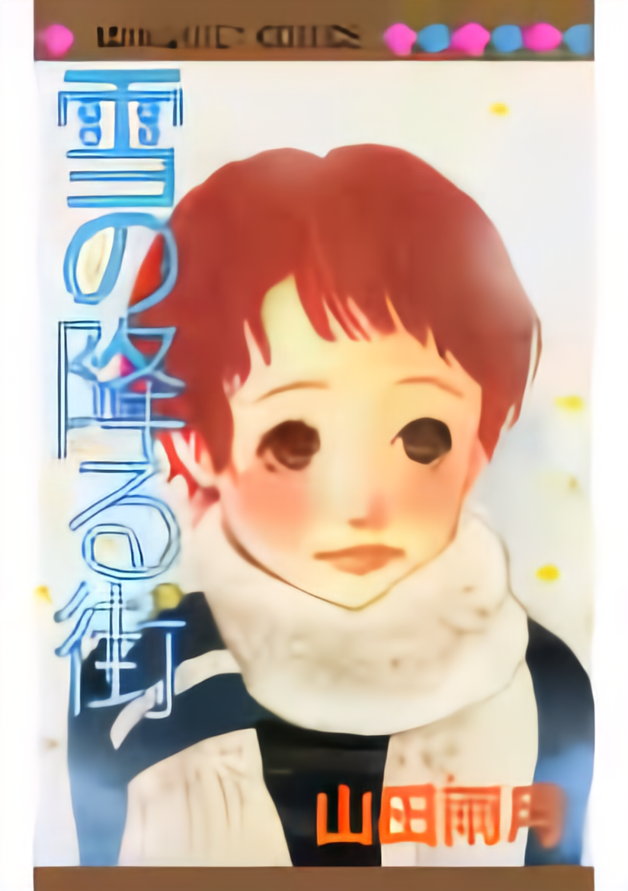 |  |  |

More qualitative results for scale factor of 4 between different methods are available in [`additional_results`](./additional_results/).

## Reference

### BibTeX
```
@article{gunawan2022cisrnet,
  title={CISRNet: Compressed Image Super-Resolution Network},
  author={Gunawan, Agus and Madjid, Sultan Rizky Hikmawan},
  journal={arXiv preprint arXiv:2201.06045},
  year={2022}
}
```
